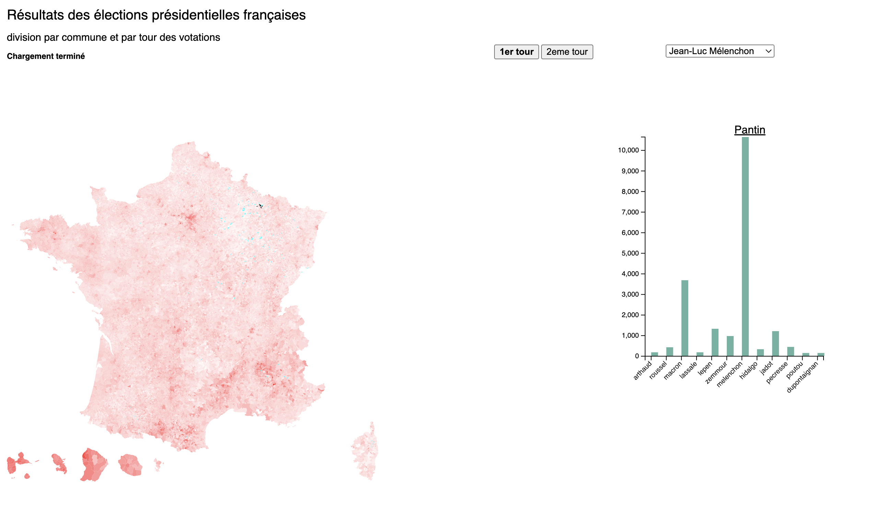

# Visualisation des donnees - Projet de cartographie interactive sur les votations présidentielles françaises 2022

Ce projet présente les résultats des élections présidentielles francçaises de 2022 de manière intéractive. Ainsi, il est possible de visualiser le pourcentage de personne ayant voté pour un candidat choisi par le biais d'un bouton par commune et en fonction du premier ou second tour.

## Base de données
Les données géographiques proviennent du site suivant [le site du gouvernement français](https://www.data.gouv.fr/fr/).

Les données statistiques sont disponibles sur [le site du gouvernement français](https://www.data.gouv.fr/fr/) et ont été nettoyées par Tristan Guerra en date du 15 avril 2022 pour le premier tour et du 25 avril 2022 pour le second. 

## Description des fonctionnalités du projet 
Ainsi les parties intéractives sont les suivantes : 
- Pendant le temps où les communes françaises chargent, il est écrit "Chargement en cours..." puis "Chargement terminé" quand cela est fini. 
- Il est possible de choisir entre le premier et le deuxième tour et l'utilisateur comprend cette information, car le bouton se met en gras. 
- Le candidat peut être choisi et la liste est différente entre le premier et le deuxième tour. 
- Le pourcentage de votants ayant choisi un candidat dans la commune est illustré par le biais d'une échelle de couleur thermique, changeant de rouge foncé à blanc puis à bleu, quand moins de 5 pourcents ont voté pour le candidat représenté.
- Des histogrammes apparaissent lors d'un clic sur une commune. Cela permet de comparer la répartition des votes pour chaque candidat.

## Outils

L'utilisation de d3 nous a permis la visualisation (cartes, barplot) et le chargement de données (géographiques et statistiques) pour visualiser les résultats des élections. 

[Topojson](https://github.com/topojson/topojson) a aussi été utilisé afin de réduire la taille du fichier de données géographiques. 

## Données
Chaque entrée dans le jeu de données géographiques correspond à une commune. Pour chaque entrée nous possédons les propriétés suivantes :
- id
- codgeo
- dep (pour le département)
- reg (pour la région)
- libgeo

 Chaque entrée dans le jeu de données statistiques correspond à une commune. Pour chaque entrée nous avons les attributs suivants :
- CodeInsee
- CodeDepartement
- Commune
- Votants (nombre de votants en tout pour la commune)

Aux attributs ci-dessus se rajoutent également le nombre de votants obtenus par les candidats dans la commune. Pour le premier tour la liste des candidats est :
- Nathalie Arthaud
- Fabien Roussel
- Emmanuel Macron
- Jean Lassalle
- Marine Le Pen
- Eric Zemmour
- Jean-Luc Mélenchon
- Anne Hidalgo
- Yannick Jadot
- Valérie Pécresse
- Philippe Poutou
- Nicolas Dupont-Aignan

Pour le second tour :
- Emmanuel Macron
- Marine Le Pen

## Interface
L'interface est composée de :
- Une carte choroplète représentant le pourcentage de votants selon le candidat choisi par commune
- Un bouton permettant de changer de tour qui modifie l'affichage de la carte et les données considérées
- Un menu déroulant permettant de changer le candidat affiché
- Un barplot apparaissant après avoir cliqué sur une commune de la carte choroplète
- Une phrase permettant de comprendre si le chargement des communes est en cours ou terminé

## Limites du projet et possibilités d'amélioration 
Limites: 
1. Tout d'abord, les communes prennent beaucoup de temps à charger, malgré l'utilisation de la librairie topojson- 
2. Lors du chargement des données il est écrit "Chargement en cours...". Toutefois cela ne se reproduit par lors de l'attente au moment où l'utilisateur a cliqué sur un bouton. De plus, il aurait été intéressant de voir apparaître un bouton représentant le pourcentage de chargement du projet en temps réel. 
3. Il aurait été intéressant de zoomer sur la carte, afin de pouvoir choisir une commune précise. Cependant, étant donné le temps de latence du chargement des communes, cela ne fonctionnait que très mal. 

Améliorations: 
1. Modifier les couleurs des communes, afin qu'elle soit selon une échelle plus esthétique
2. Assortir la couleur des histogrammes avec les couleurs des communes 
3. Centrer la carte, qui est l'information centrale et faire apparaître l'histogramme dans un coin de la carte
4. Rendre le projet plus rapide 

## Utilisation
Ce projet n'est pas sur un serveur, il faut donc l'afficher localement. Il existe de multiples méthodes pour faire cela. Toutefois, nous vous proposons une explication étape par étape ci-dessous pour afficher localement notre projet en utilisant python3.
1. Télécharger le zip du projet, le décompresser
2. Ouvrir un Terminal et changer le chemin pour aller au dossier décompressé précédemment
ex : cd /Users/username/Desktop/Visualisation_des_donnees
3. Lancer un serveur local en lançant la commande suivante dans le terminal : `python3 -m http.server`
4. Le terminal devrait afficher la phrase suivante : `Serving HTTP on :: port 8000`
5. Ouvrir un navigateur (Firefox, Chrome) et entrer l'adresse suivante : `localhost:8000`

## Auteurs
Ce projet a été réalisé par Max Henking et Axelle Bersier pour l'évaluation du cours de "Visualisation de données", un cours de Master donné par le professeur Isaac Pante(SLI, Lettres, UNIL) à l'université de Lausanne au printemps 2022.

## Remerciements
Mike Bostock pour D3, TopoJSON et tout les exemples.
Isaac Pante pour les cours et conseils.
La communauté StackOverflow pour l'aide précieuse.
